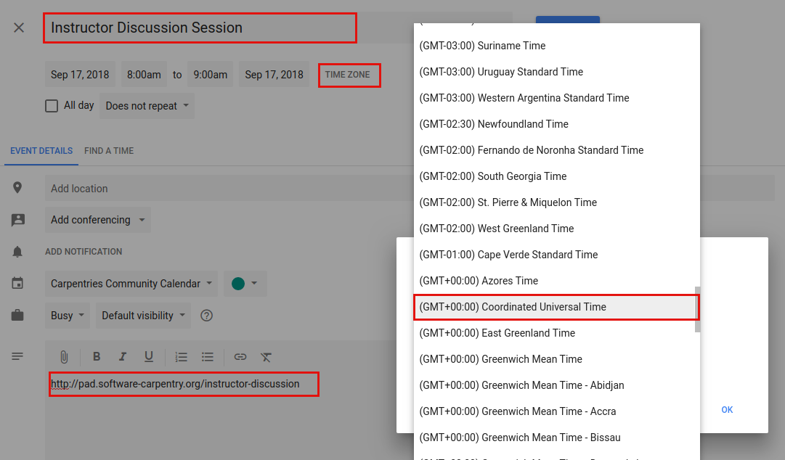
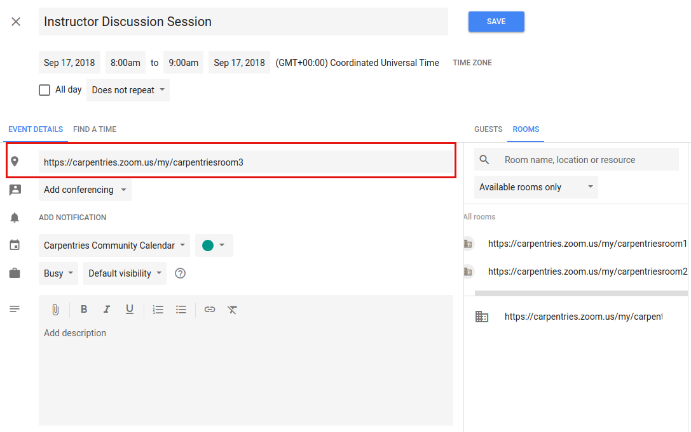

## Zoom Rooms

The Carpentries offers three Zoom rooms for public community events.  Zoom rooms are available for The Carpentries events such as instructor trainings, discussion sessions, teaching demos, and committee meetings.

### General Room Usage and Links

Rooms are generally used as follows. However, any room can be used for other purposes if it is available.

* Room 1: Instructor Training
* Room 2: Community events (teaching demos, discussion sessions, committee meetings, etc.)
* Room 3: Other events as needed 

Events are scheduled for each room by The Carpentries Core Team. Each event will have a URL in the format `https://carpentries.zoom.us/j/**1234567**`.  This URL can only be used for that specific event. In the interest of security, these rooms will be unavailable at other times.

For Instructor Training events, this link will be shared with the Trainers and trainees for that event.  For Community Discussion sessions and Teaching Demos, the link will be on the relevant Etherpad and in that event's description on our Community Calendar.  Participants will not need a password to enter, but the event host may enable a waiting room for the event. 

### Information for event hosts

Please read below if you are teaching an Instructor Training workshop or hosting a Teaching Demo or Community Discussion.

#### Gaining Host Access

If you are teaching an Instructor Training workshop, about a week before the event, you will receive an email with host credentials and other logistical information.

If you are hosting a Community Discussion or Teaching Demo, you should have signed up to do so via Calendly. Two days before the event, you will receive an automated email from Calendly that includes the host key for the event. 

Enter the room and select "Participants."

Near the bottom of the Participants view is a button to Claim Host Access.  This will open up a pop up window where you will be able to enter in the Host Key you were given.  You will now have host access.  It is not possible to claim host access in this way if a logged on host is already present.  The logged on host can transfer host access to another participant.

#### Creating a Waiting Room

Once you have entered and claimed host access, it is recommended that you create a waiting room.  This enables you to explicitly let people in, rather than allowing anyone to simply come in.  It helps prevent "zoombombing," or entry of unwelcome guests.

Click on "Security" in the bottom panel.  At this point, you can lock the room entirely.  This is not recommended, as someone who accidentally gets bumped off the call or other latecomers will not be able to re-join.  Select "Enable Waiting Room."  This will give you (as host) a notification every time someone tries to enter the room.  You can admit them individually or as a group. You can also message the waiting room (as a whole; not individuals) before admitting them. 

#### Assigning a co-host

A host may assign a co-host. The co-host has most, but not all, of the privileges of the host.

A co-host can:
- Admit people from the waiting room
- Mute/unmute people

A co-host can not:
- Create breakout rooms 

#### Turning participants' audio and video on or off

As host, you will be able to mute and unmute participants.

#### Creating Breakout Rooms

Breakout rooms can be created automatically or manually. Only the host (not the co-host) has the ability to create "Breakout rooms". The button for this is on the lower left. Breakout rooms can be created manually or automatically.

- Manually create rooms: You can manually assign people to the number of rooms of your choice. This is useful if you know you want to have certain people together, or if you want to have rooms of varying sizes. It is recommended that you add in 1-2 empty rooms to make it easier to change rooms during the session. Zoom will not allow you to create more rooms during the breakout session.
- Automatically create rooms: Zoom will automatically divide your participants in a given number of rooms. For example, if you have 25 participants and choose 4 rooms, Zoom will randomly assign them to 4 rooms of 6-7 people each.
- The host can manually end breakout rooms by clicking on the button in the breakout rooms window. All breakout rooms will then get a 60-second warning and automatically be returned to the main room. Closing breakouts can not be scheduled in advance.  Participants can return to the main room early if they choose.
- The host can move between breakout rooms and can send messages to all rooms simultaneously. 
- People in the breakout rooms will see a button to ask the host for help. The host will get a notification to join that room. Participants can not communicate across breakout rooms.  

#### Yes/no questions

The host can ask yes/no questions. Responses are always public.

#### Screen sharing

The host can decide whether any participant can share their screen, or limit this access to host only.  Screen sharing access can not be granted or denied to specific participants only.

Options to share whole desktop or a given window.

#### Zoom chat

Zoom chat allows participants to send messages to the whole group or to a select individual. Group chats are not an option.

A participant can only see the chat since they most recently joined. If a participant leaves and re-enters, they will not see old chats. Also, Zoom chat is not consistently preserved across breakout rooms. The original main room chat may not be available when participants return from a breakout room.

Emojis are not recommended as they are not consistently available and do not render consistently across platforms.

#### Ending a call

When the room host clicks “End Meeting” a dialogue box appears with three options: “Cancel”, “Leave Meeting” and “End Meeting for All”. Be careful not to end the meeting if you are leaving the room while the event is still active.

If the host leaves while participants are still in the room, 

### General Tips

- “Gallery view” in the upper right toggles the display to show more participants videos.  

- If a trainee is using Linux and gets the error message "Can not start share, wayland has not been supported yet, 
please use x11 instead", have them log out of Zoom and log back in. On the login screen there is a gear with a dropdown menu there choose the option with x11.

### Scheduling Zoom Rooms

Zoom Room 1 is scheduled by The Carpentries Core Team for online instructor training events. Zoom Room 2 is for Community Discussions and Instructor Training Demos. These events are scheduled by Discussion Hosts and Trainers using Calendly. Attendees can sign up to attend these events on the relevant Etherpads.

- Community Discussions:
  - [Calendly for Hosts](https://calendly.com/carpentries-discussion-sessions/thecarpentries)
  - [Etherpad for Attendees](https://pad.carpentries.org/community-discussions)

- Teaching Demos:
  - [Calendly for Hosts](https://calendly.com/carpentries-trainers-signup)
  - [Etherpad for Attendees](https://pad.carpentries.org/teaching-demos)

If you would like to schedule a Zoom Room for another event, please [contact us at team@carpentries.org](mailto:team@carpentries.org).

#### Viewing Zoom Room Availability

Zoom room calendar views are public - anyone can view whether a room is available.  Only Carpentries staff members can actually book a room. If a room is available, please contact a staff member or team@carpentries.org if you would like to make a room reservation.

Room availability can be viewed below. 
* Red: Room 1
* Orange: Room 2
* Green: Room 3

Placeholder: Embedded Zoom Room Calendar

#### Adding an Event to the Community Calendar

Note while anyone can view room availability, only Carpentries staff members may book events or reserve a Zoom room.

To add an event to the [Community Calendar](https://calendar.google.com/calendar/embed?src=oseuuoht0tvjbokgg3noh8c47g%40group.calendar.google.com&ctz=America%2FNew_York) and book a Zoom Room for it:

* Give the event a meaningful title ("Demos" is not as good as "Instructor Training Teaching Demos")
* List the time zone in UTC - not your local time zone.  Events set in local time zones do not always correctly adjust for daylight savings time.
* Add a description, including a link to the relevant Etherpad or other document.

* Select a room.

    

    * Each available room will be listed. If you are scheduling a recurring event, any future conflict will prevent a given room from being listed as available.
    * Multiple rooms can be selected for a single event.
    * Click on a room to select it.  The Zoom link will now appear in the location.

    

    * If you select a room and immediately remove it, it may not appear as available again until you close out the edit event screen and enter it again.
    * Save the event.
    * The event will now show up on The Carpentries Community Calendar and the Zoom Rooms Calendar.

Be sure to complete the above steps in order (i.e., do not select a room before setting the exact date and time).

#### Creating a Zoom Room Option on Google Calendars

This will only need to be done once for each new room.  This is already done for Zoom Rooms 1, 2, and 3.  If additional Zoom rooms are added, they will need to be set up here.  This must be done by someone with admin access to The Carpentries' Google console.  

Go to the [Google admin console](https://admin.google.com/AdminHome?hl=en).  Click on "Buildings and Resources" and then click "Edit Resources" under "Resource Management."

You will see all existing buildings and rooms listed. This feature is meant for physical buildings; we are using it for virtual videoconferencing rooms. One "building" is set up, called "Zoom Rooms" that contains three resources -- Zoom Room 1, Zoom Room 2, and Zoom Room 3.  

To add a new "room" in this "building" - click on the yellow plus sign next to "Resources."  Fill out the following information:

* Category: (no category set)
* Type: *leave blank*
* Building: Undefined
* Floor: Undefined
* Floor section: *leave blank*
* Resource name: Link to the Zoom Room
* Capacity: 100 (standard for all Zoom rooms)
* Features: *leave blank*
* User visible description: Note what this room is used for.

When done, click "ADD RESOURCE" and this new room should be on your list of rooms.  This room will now be available for scheduling events as described above.

