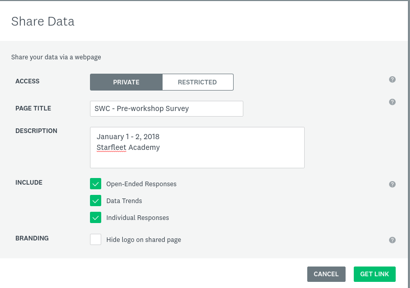

### Setting up surveys using Survey Monkey

The Carpentries uses [Survey Monkey](https://www.surveymonkey.com/) to manage all workshop surveys. 

#### Logging in

Workshop Administrators will have log in credentials from the Carpentries to set up surveys.  They will share links to view survey results with workshop hosts and instructors. Hosts and instructors do not need log in credentials.

Contact team@carpentries with questions about logging in.

#### Setting up a workshop survey

If a learner accesses the survey from that workshop's website (in the format `username.github.io/YYYY-MM-DD-sitename`), the survey links will be appended with the workshop slug (so https://www.surveymonkey.com/r/swc_pre_workshop_v1 becomes https://www.surveymonkey.com/r/swc_pre_workshop_v1?workshop_id=YYYY-MM-DD-sitename).

The "naked" link will take them to the exact same survey, but will make it slightly more difficult for us to share survey results.

The survey has already been designed, and we will not customize any of the questions for specific workshops or sites.

The existing questions about which workshop the learner is attending are being deprecated in favor of a new question:

Learners are prompted to fill in their workshop ID or the workshop date and location if the ID is not known. Having this information accurate and complete is crucial to being able to share survey results.

#### Sharing survey results: Web view

Survey results can be shared as a website view with charts and graphs of aggregate data.

From the workshop page, select `Analyze Results`.

Select `Filter` and `Filter by Question and Answer`.

Select the question about the workshop ID:

In the next box, enter the workshop ID that you want to get results for.  Select `Exact phrase` to get that workshop ID exactly.

This will take you to an internal view of the survey results for that event. To create a public view, click the green `Save as` button at the top right, and select `Shared data link`.

This will open a new page for you to set up your public view.

Set the following options:

* Access: Private. This means anyone with the link can view the results. You can make this password protected by selecting "Restricted." You can then share passwords with hosts, instructors, and anyone else who may need access.
* Page Title: This will prepopulate with a default value. You can change this as you wish.
* Page Description: Add any other information about the workshop.
* Include: Be sure to check off Open-Ended Responses and Data Trends. Individual Responses should **not** be checked.
* Branding: Leave this unchecked.

Click `Get link`.

You will be given a link to the survey results. Click save.

Your browser will now redirect to this link. The link can be shared with hosts and instructors.

This link will also be included in the Shared Data List, at the bottom of the left side of the screen.

It will be given a sequential number. Click on the `...` to rename it to the workshop ID.  This list is monitored regularly, and anything with the sequential number will be deleted.

#### Sharing survey results: Raw data

If requested, raw data as csv can be exported and shared with hosts and instructors.

From the internal view of the survey results click the green `Save as` button at the top right. This time, click `Export file`.

From here you will have various options about what data to export and what format to export it in. Make your selections and name the filename with the workshop ID.

This will then show up in the "Exports" list on the left side of the screen.  Click the "..." to download data to share with hosts and instructors.

#### Modifying survey responses

Survey data can be modified once a user has submitted their response.  To protect the integrity of our data, this should be done *only* if it is known that a respondent filled in an incorrect or incorrectly formatted workshop id.

From the survey page, select `Analyze Results`.

Following the instructions above, search for the possible responses to a workshop id.  For example, search for all responses containing the word 'starfleet' to find any one who may have attended the workshop '2018-01-01-starfleet'.  

Use the arrow icons to navigate to the response that needs editing, and click "edit".  

The survey will open in a new window.  Navigate to the workshop id question without editing any other responses.

Type in the correct workshop id and click next.

Close this window so no other responses are affected. This should now show up modified and correct in the Survey Monkey responses.

Continue this for any incorrect response.

Running a report as described above should now give you correct responses.

